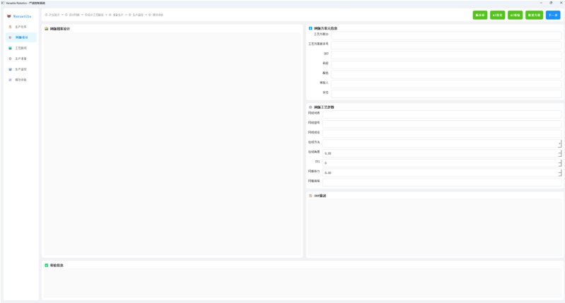
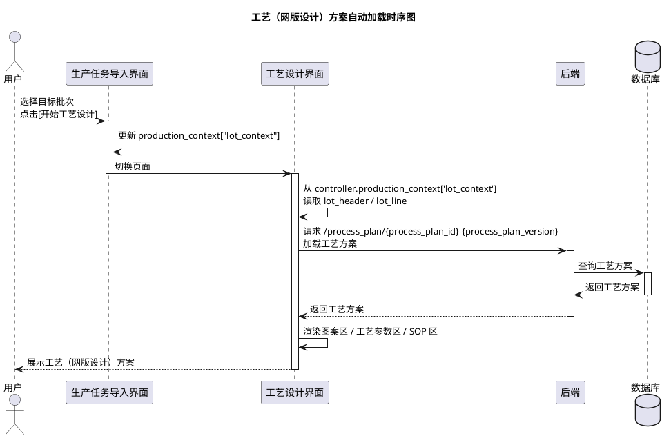
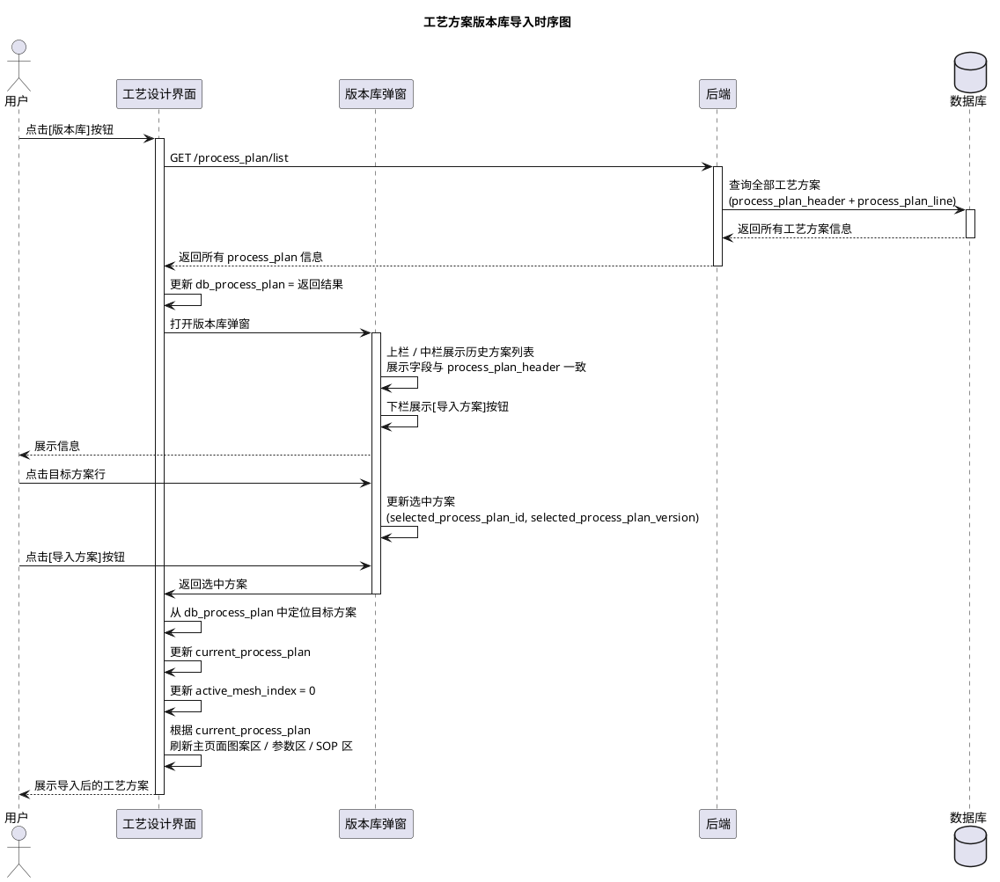
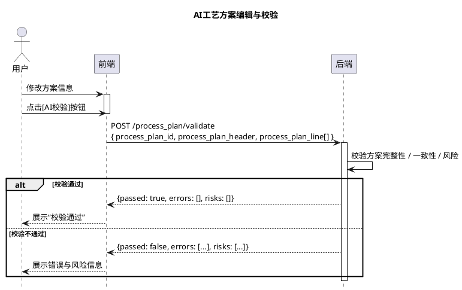
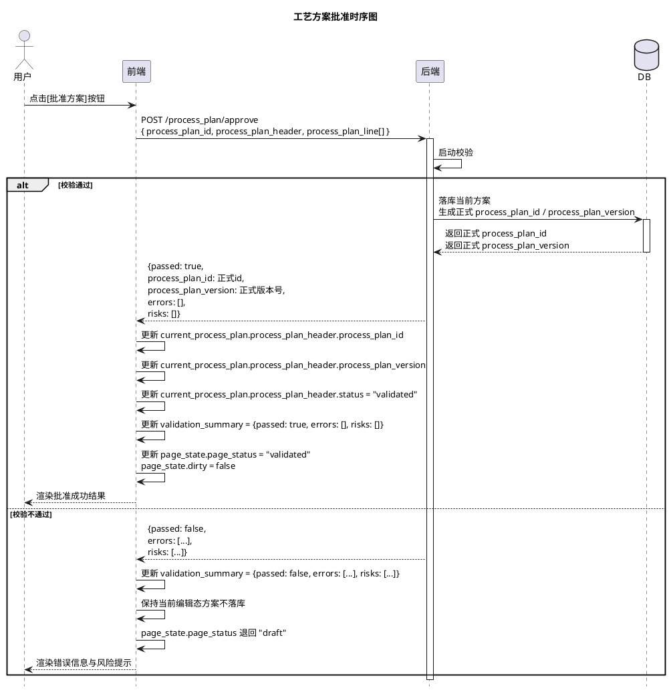

# [FeatureDoc] 工艺设计 B0.1

## 背景

网版设计是运动鞋面丝印产线控制系统的工艺规划模块。

关联资料：

- `[PRD]产线控制软件V0.1`
- `[数据模型]产线控制软件V0.1`

## 目标

搭建网版设计模块的最小闭环：

1. 方案导入：从历史方案库中选择导入。
2. 方案编辑：支持用户编辑工艺方案元信息、网版参数信息、操作步骤信息。
3. 方案批准与冻结。

## 系统

### 图片说明

- 图片 `images/fig01_system_ui_page1.png`：工艺设计主界面示意图（来自原文首页“系统”部分）。



## 架构

### 前端

- 页面装配：由 `app.py` 装配 `main_window.ui + separation_page.ui + separation_page`。
- 页面阶段：`stage: "process_plan"`。
- 状态字段：
  - `loading: bool`，当前是否存在异步请求。
  - `dirty: bool`，当前主编辑对象在最近一次导入 / 自动生成 / 校验后是否被修改。
- `focus`：
  - `selected_process_plan_id: str | null`，当前在版本库弹窗中选中的历史工艺方案 ID。
  - `selected_process_plan_version: int | null`，当前在版本库弹窗中选中的历史工艺方案版本号。
  - `active_mesh_index: int | null`，当前正在查看和编辑的网版索引；用于驱动图案区、网版参数区、SOP 区联动。
- `dialogs`：
  - `library_open: bool`，历史版本库弹窗是否打开。
- `data`：
  - `db_process_plan`：历史工艺方案集合。
  - `current_process_plan`：
    - `process_plan_header: dict`，工艺方案头。
    - `process_plan_line: list[dict]`，工艺方案行。
- `validation_summary`：
  - `passed: bool`，`current_process_plan` 最近一次校验是否通过。
  - `errors: list[str]`，当前方案最近一次校验返回的阻断性错误。
  - `risks: list[str]`，当前方案最近一次校验返回的风险提示。

### 产线上下文

产线上下文由 `self.controller.production_context` 维护，包含：

- `production_line_context`
- `order_context`
- `lot_context`
- `process_plan_context`
- `process_route_context`
- `prep_instruction_context`

### 主要数据映射

- `process_plan_line[active_mesh_index].pattern_design` 映射到网版图案设计区。
- `process_plan_header` 映射到方案元信息区。
- `process_plan_line[active_mesh_index]` 中的以下字段映射到网版工艺参数区：
  - `mesh_model`
  - `diameter`
  - `stretching`
  - `stretching_degree`
  - `tpi`
  - `tension`
  - `frame_specification`
- `process_plan_line[active_mesh_index].operation` 映射到印刷步骤区。
- 校验信息区映射到 `validate` 接口返回的 `passed / errors / risks`。
- 所有编辑动作都会实时更新到 `current_process_plan`。

### 后端

- 技术选型：`FastAPI + Langgraph`
- 模块：
  - `api.py`：路由模块，负责请求接受、响应声明、HTTP 异常映射。
  - `schema.py`：接口契约层。
  - `models.py`：数据层。
  - `agent`
  - `graph.py`：图定义。
  - `tools.py`：智能体工具与服务。

### 数据对象

- `process_plan_header`：工艺方案头。
- `process_plan_line`：工艺方案行。

## 主流程

### 1. 方案自动加载

#### 主流程

1. 在前端生产任务导入界面选择目标批次，并点击 **开始工艺设计** 按钮。
2. 前端切换至工艺设计界面（`process_plan_page`）。
3. 前端从 `controller.production_context['lot_context']` 中读取当前批次的 `lot_header / lot_line`，并基于 `sku / color / size` 信息生成工艺方案名。
4. 前端向后端发送请求；后端查找相应的工艺方案，并将其返回至前端。
5. 前端更新 `current_process_plan` 和 `active_mesh_index`，并渲染展示。

#### API

`GET /process_plan/{process_plan_id}-{process_plan_version}`：获取特定的方案信息。

**格式**

- 入参：`NA`
- 出参：

```json
{
  "process_plan_header": {},
  "process_header_line": []
}
```

#### 测试用例

请求：

```text
GET /process_plan/PP-8PRO-神行橘-43-3
```

返回（示例）：

```json
{
  "process_plan_header": {
    "process_plan_id": "PP_8PRO_神行橘_43",
    "process_plan_version": 3,
    "sku": "8Pro",
    "size": "43",
    "color": "神行橘",
    "pattern_design": "8pro_orange_v3.ai",
    "validated_by": "",
    "status": "validated"
  },
  "process_plan_lines": [
    {
      "process_plan_id": "PP_8PRO_神行橘_43",
      "process_plan_version": 3,
      "mesh_index": 1,
      "material": "PET",
      "mesh_model": "N-120",
      "diameter": 120.0,
      "stretching": "直拉",
      "stretching_degree": 0,
      "tpi": 180,
      "tension": 180.0,
      "frame_specification": "420 x 520",
      "operation": "印料: 白墨\n刮印次数: 3\n刮刀角度: 30\n刮刀速度: 20\n离网距: 0.3\n烘干温度: 110"
    },
    {
      "process_plan_id": "PP_8PRO_神行橘_43",
      "process_plan_version": 3,
      "mesh_index": 2,
      "material": "PET",
      "mesh_model": "N-150",
      "diameter": 150.0,
      "stretching": "斜拉",
      "stretching_degree": 45,
      "tpi": 180,
      "tension": 185.0,
      "frame_specification": "450 x 600",
      "operation": "印料: 橘墨\n刮印次数: 2\n刮刀角度: 28\n刮刀速度: 18\n离网距: 0.25\n烘干温度: 108"
    }
  ]
}
```

### 2. 方案手动加载

#### 主流程

1. 点击 **版本库** 按钮，前端通过 `/process_plan/list` 向后端申请所有工艺方案。
2. 后端在数据库中拉取工艺方案，并返回至前端。
3. 前端更新 `db_process_plan`。
4. 前端弹出窗口。弹出窗口分为 2 部分：上栏 / 中栏为历史方案列表，展示信息与 `process_plan_header` 一致；下栏包含 **导入方案** 按钮。
5. 点击目标方案行，并点击 **导入方案** 按钮，前端更新 `current_process_plan`。
6. 前端根据 `current_process_plan` 更新主页面。

#### API

`GET /process_plan/list`：获取所有历史版本。

**格式**

- 入参：`NA`
- 出参：

```json
{
  "db_process_plans": [
    {
      "process_plan_header": {},
      "process_plan_line": []
    }
  ]
}
```

#### 测试用例

请求：

```text
GET /process_plan/list
```

反馈（示例）：

```json
{
  "db_process_plans": [
    {
      "process_plan_header": {
        "process_plan_id": "PP-8PRO-神行橘-43",
        "process_plan_version": 3,
        "sku": "8Pro",
        "size": "43",
        "color": "神行橘",
        "asset": "8pro_orange_v3.ai",
        "validated_by": "zhangsan",
        "status": "validated"
      },
      "process_plan_lines": [
        {
          "process_plan_id": "PP-8PRO-神行橘-43",
          "process_plan_version": 3,
          "mesh_index": 1,
          "material": "PET",
          "mesh_model": "N-120",
          "diameter": 120.0,
          "stretching": "直拉",
          "stretching_degree": 0,
          "tpi": 180,
          "tension": 180.0,
          "frame_specification": "420 x 520",
          "operation": "印料: 白墨\n刮印次数: 3\n刮刀角度: 30\n刮刀速度: 20\n离网距: 0.3\n烘干温度: 110"
        },
        {
          "process_plan_id": "PP-8PRO-神行橘-43",
          "process_plan_version": 3,
          "mesh_index": 2,
          "material": "PET",
          "mesh_model": "N-150",
          "diameter": 150.0,
          "stretching": "斜拉",
          "stretching_degree": 45,
          "tpi": 180,
          "tension": 185.0,
          "frame_specification": "450 x 600",
          "operation": "印料: 橘墨\n刮印次数: 2\n刮刀角度: 28\n刮刀速度: 18\n离网距: 0.25\n烘干温度: 108"
        }
      ]
    }
  ]
}
```

### 3. 方案编辑

#### 主流程

1. 在网版图案设计区中通过选择按钮 `[<]`（`mesh_index - 1`）和 `[>]`（`mesh_index + 1`）切换不同网版。
2. 前端通过修改 `active_mesh_index`，在 `current_process_plan` 中切换不同网版并渲染展示：
   - 网版方案元信息
   - 网版工艺参数
   - 印刷步骤信息
3. 点击 **AI 校验** 按钮完成校验：
   - 若校验通过，校验反馈区展示“校验通过”。
   - 若校验失败，校验反馈区展示错误与风险信息。

#### API

`POST /process_plan/validate`：把正在编辑的方案整体提交给后端校验。

**格式**

入参：

```json
{
  "process_plan_header": {},
  "process_plan_line": []
}
```

出参：

```json
{
  "passed": true,
  "error": [],
  "risks": []
}
```

#### 测试用例

请求（示例）：

```json
{
  "process_plan_header": {
    "process_plan_id": "PP_8PRO_神行橘_43",
    "process_plan_version": 3,
    "sku": "8Pro",
    "size": "43",
    "color": "神行橘",
    "pattern_design": "8pro_orange_v3.ai",
    "validated_by": "",
    "status": "validated"
  },
  "process_plan_lines": [
    {
      "process_plan_id": "PP_8PRO_神行橘_43",
      "process_plan_version": 3,
      "mesh_index": 1,
      "material": "PET",
      "mesh_model": "N-120",
      "diameter": 120.0,
      "stretching": "直拉",
      "stretching_degree": 0,
      "tpi": 180,
      "tension": 180.0,
      "frame_specification": "420 x 520",
      "operation": "印料: 白墨\n刮印次数: 3\n刮刀角度: 30\n刮刀速度: 20\n离网距: 0.3\n烘干温度: 110"
    },
    {
      "process_plan_id": "PP_8PRO_神行橘_43",
      "process_plan_version": 3,
      "mesh_index": 2,
      "material": "PET",
      "mesh_model": "N-150",
      "diameter": 150.0,
      "stretching": "斜拉",
      "stretching_degree": 45,
      "tpi": 180,
      "tension": 185.0,
      "frame_specification": "450 x 600",
      "operation": "印料: 橘墨\n刮印次数: 2\n刮刀角度: 28\n刮刀速度: 18\n离网距: 0.25\n烘干温度: 108"
    }
  ]
}
```

反馈：

```json
{
  "passed": true,
  "errors": [],
  "risks": []
}
```

### 4. 方案批准与冻结

#### 主流程

1. 在方案被验证过后，点击 **批准方案** 按钮。
2. 前端通过 `/process_plan/approve` 将当前方案信息发往后端。
3. 如果校验通过，后端将方案信息落库，并返回正式 `process_plan_id` 和 `process_plan_version`。
4. 如果校验不通过，后端返回错误信息和风险信息。
5. 前端根据返回结果更新前端状态量，并渲染结果。

#### API

`POST /process_plan/approve`：冻结批准当前方案。

**格式**

入参：

```json
{
  "process_plan_id": {},
  "process_plan_lines": []
}
```

出参：

```json
{
  "approved": true,
  "process_plan_id": "",
  "process_plan_version": "",
  "error_info": [],
  "risk_info": []
}
```

#### 测试用例

请求（示例）：

```json
{
  "process_plan_header": {
    "process_plan_id": "TMP-PP-8PRO-神行橘-43",
    "process_plan_version": 3,
    "sku": "8Pro",
    "size": "43",
    "color": "神行橘",
    "pattern_design": "8pro_orange_v3.ai",
    "validated_by": "",
    "status": "validated"
  },
  "process_plan_lines": [
    {
      "process_plan_id": "TMP-PP-8PRO-神行橘-43",
      "process_plan_version": 3,
      "mesh_index": 1,
      "material": "PET",
      "mesh_model": "N-120",
      "diameter": 120.0,
      "stretching": "直拉",
      "stretching_degree": 0,
      "tpi": 180,
      "tension": 180.0,
      "frame_specification": "420 x 520",
      "operation": "印料: 白墨\n刮印次数: 3\n刮刀角度: 30\n刮刀速度: 20\n离网距: 0.3\n烘干温度: 110"
    },
    {
      "process_plan_id": "TMP-PP-8PRO-神行橘-43",
      "process_plan_version": 3,
      "mesh_index": 2,
      "material": "PET",
      "mesh_model": "N-150",
      "diameter": 150.0,
      "stretching": "斜拉",
      "stretching_degree": 45,
      "tpi": 180,
      "tension": 185.0,
      "frame_specification": "450 x 600",
      "operation": "印料: 橘墨\n刮印次数: 2\n刮刀角度: 28\n刮刀速度: 18\n离网距: 0.25\n烘干温度: 108"
    }
  ]
}
```

反馈：

```json
{
  "passed": true,
  "process_plan_id": "PP-8PRO-神行橘-43",
  "process_plan_version": 4,
  "error_info": [],
  "risk_info": []
}
```

## 附录

> 原文中的时序图已替换为 PlantUML 代码块。

### 附录 1：工艺（网版设计）方案自动加载时序图



### 附录 2：工艺方案版本库导入时序图



### 附录 3：AI 工艺方案编辑与校验



### 附录 4：工艺方案批准时序图


