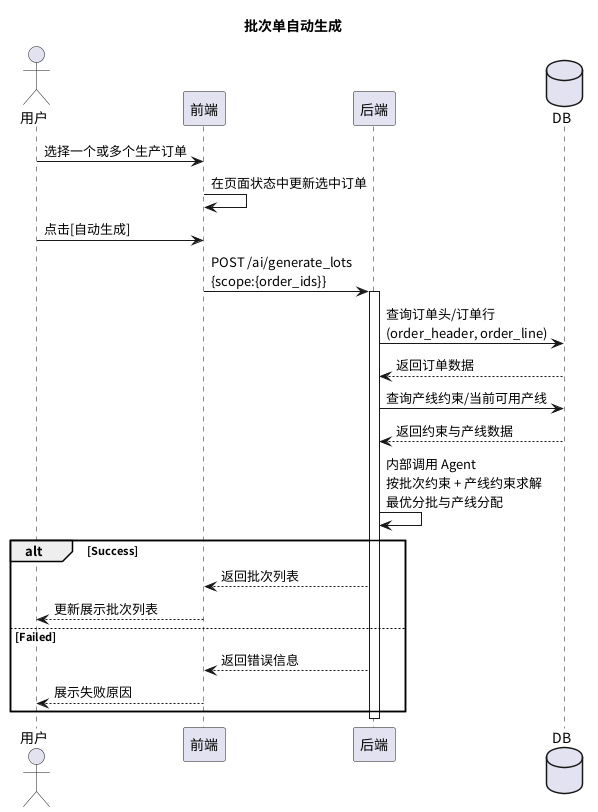
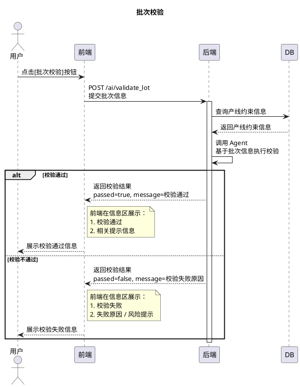

# [FeatureDoc] 批次单自动生成与校验 B0.0

> 转写说明：
> 1. 本文件由 PDF 转写为 Markdown。
> 2. 文中时序图已优先替换为附录中的 PlantUML 代码，并保留原始截图资源。
> 3. 原文中的字段命名、大小写、拼写差异尽量按原文保留，未做统一修订。

## 背景

批次单是生产任务最小组织单元。目前已实现批次单管理的基本功能。

### 相关文档

-  `[PRD]产线控制软件V0.1`
- `[DesignDoc]生产任务导入B0.0`

## 目标

实现批次单管理智能辅助的最小闭环：

1. 批次单的自动生成
2. 批次单的自动校验

## 方案

### 1. 功能描述

#### a. 批次单的自动生成

##### 界面

生产任务导入界面

##### 关键步骤

1. 在前端生产订单列表中选择一个或多个生产订单。
2. 点击 `[自动生成]` 按钮，前端向后端发送请求；后端调用 `Agent`，根据批次约束和产线约束安排最佳产线与批次组成，并将结果反馈至前端。
3. 在前端批次列表中，点击生成批次，在弹出窗口中查看结果。

##### 时序图



##### API 设计

###### `POST /ai/generate_lots` 自动生成批次单

- 入参：

```json
{
  "selected_orders": ["order_id"]
}
```

- 出参：

```text
{
  passed: bool，产生 lot 是否成功
  message: str，相关信息
  lots: [
    {
      lot_header: {
        lot_id: str，生产批次号
        source_order_id: list[str]，关联的生产订单号
        production_line_id: str，产线编号
      }
      lot_line: [
        {
          lot_line_id: str，当前批次行 id
          color_separation_plan: str，当前 sku 分色方案
          source_order_id: str，关联订单号
          source_order_line_id: str，关联生产订单行号
          color_separation_plan: str，当前 sku 分色方案版本 id
          status: str，批次行状态 created
        }
      ]
    }
  ]
}
```

##### 测试用例

- 请求：

```json
{
  "selected_orders": ["PO-20260206-01"]
}
```

- 反馈：

```json
{
  "passed": "true",
  "message": "成功创建 LOT-20260206-001",
  "lots": [
    {
      "lot_header": {
        "lot_id": "LOT-20260206-001",
        "source_order_ids": ["PO-20260206-01"],
        "production_line_id": "F01-SP01"
      },
      "lot_line": [
        {
          "lot_id": "LOT-20260206-001",
          "lot_line_id": 1,
          "source_order_id": "PO-20260206-01",
          "source_order_line_id": 1,
          "sku": "8Pro",
          "color": "神行橘",
          "size": 43,
          "color_separation_plan": "CS-8Pro-神行橘-43",
          "quantity_planned": 1200
        }
      ]
    }
  ]
}
```

#### b. 批次单自动校验

##### 界面

生产任务导入界面

##### 关键步骤

1. 点击 `[批次校验]` 按钮，前端向后端发送请求并附送批次信息；后端调用 `Agent`，基于批次信息进行校验。
2. 后端将校验信息反馈至前端，前端通过信息区向用户展示。

##### 时序图



##### API 设计

###### `POST /ai/validate_lots` 验证上传批次信息是否满足批次约束

- 入参：

```json
{
  "pending_lots": []
}
```

- 出参：

```json
{
  "validation_results": [
    {
      "lot_id": "lot_id",
      "passed": true,
      "errors": [],
      "risk_info": []
    }
  ]
}
```

##### 测试用例

- 请求：

```json
{
  "pending_lot": [
    {
      "lot_header": {
        "lot_id": "LOT-20260206-001",
        "source_order_ids": ["PO-20260206-01"],
        "production_line_id": "F01-SP01"
      },
      "lot_line": [
        {
          "lot_id": "LOT-20260206-001",
          "lot_line_id": 1,
          "source_order_id": "PO-20260206-01",
          "source_order_line_id": 1,
          "sku": "8Pro",
          "color": "神行橘",
          "size": 43,
          "color_separation_plan": "CS-8Pro-神行橘-43",
          "quantity_planned": 1200
        }
      ]
    }
  ]
}
```

- 反馈：

```json
{
  "validation_results": [
    {
      "lot_id": "LOT-20260206-001",
      "passed": true,
      "errors": [],
      "risk_info": []
    }
  ]
}
```

### 2. 批次单约束

#### a. 混线约束

1. `sku` 一致
2. 质检（`fabirc_material / fabric_thickness / basecoat_thickness / ink_thickness / flatness`）要求一致

#### b. 产线约束

1. 分色层数 `<=` 丝印工作站总数 `- 3`

## 附录

### 1. 时序图代码与原始截图

#### 1. 批次单自动生成


原始截图：


#### 2. 批次校验


原始截图：


