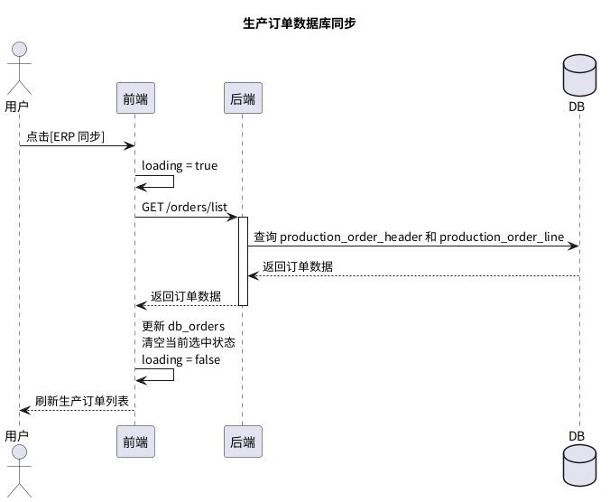
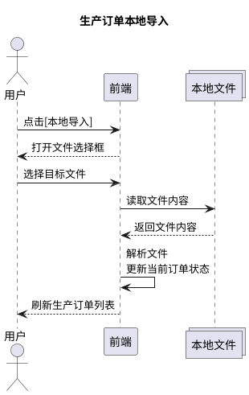
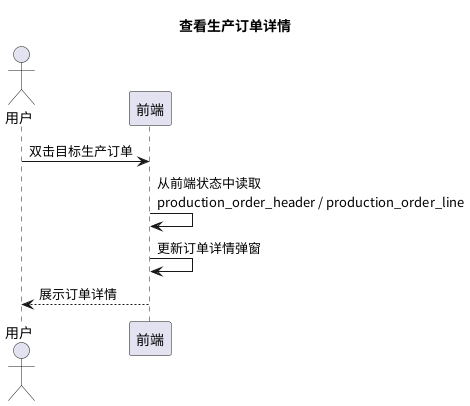
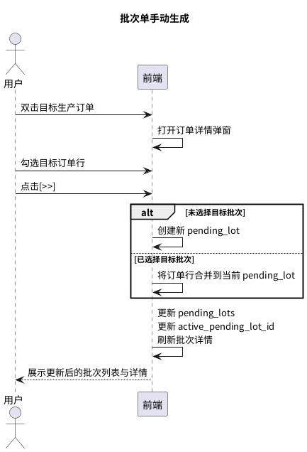
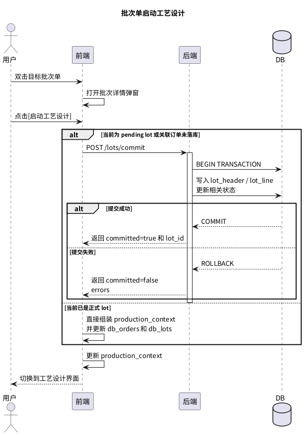

# [FeatureDoc] 生产任务导入 B0.1

> 转写说明：
> 1. 本文件由 PDF 转写为 Markdown。
> 2. 文中时序图已优先替换为附录中的 PlantUML 代码，并保留原始截图资源。
> 3. 原文中的字段命名、大小写、拼写差异尽量按原文保留，未做统一修订。

## 背景

生产订单管理是运动鞋面丝印产线控制系统的前置模块。

### 相关文档

-  `[PRD]产线控制软件V0`
-  `[产线控制软件V0]数据模型`

## 目标

搭建生产订单管理的最小闭环：

1. 导入生产订单
2. 创建批次单
3. 校验批次单
4. 启动工艺设计

## 系统

### 1. 架构

#### a. 前端

1. 技术选型：`PyQT5`
2. 页面装配：通过 `app.py` 将 `main_window.ui` 和 `import_page.ui` 装配起来。
3. 前端状态：

```text
{
  page_state: {
    stage: str, 当前页面阶段："lot | process_plan | process_route | prep_instruction"
    loading: bool, 当前是否存在异步请求
    dirty: bool, 当前主编辑对象在最近一次导入/校验后是否被修改
    focus: {
      selected_order_ids: list[str] | null, 当前选中的订单
      selected_order_lines: list[str] | null, 当前勾选的订单行
      selected_lot_ids: list[str] | null, 当前选中的批次单 id
      selected_lot_lines: list[str] | null, 当前选中批次单行
    }
    dialogs: {
      order_import_open: bool, 订单导入弹窗是否打开
      order_detail_open: bool, 订单行弹窗是否打开
      lot_detail_open: bool, 批次单详情弹窗是否打开
    }
    data: {
      db_orders: list[dict], 从数据库中读入的生产订单，
                 每个生产订单包含 production_order_header 和 production_order_lines
      db_lots: list[dict], 从数据库中读入的批次单，
               每个批次单包含 lot_header 和 lot_header_lines
      pending_orders: list[dict], 本地导入尚未落库的生产订单
      pending_lots: list[dict], 新创建的或者尚未落库的生产批次单
    }
    validation_summary: {
      passed: bool, 当前激活工作对象最近一次校验是否通过
      errors: list[str], 阻断性错误
      risks: list[str], 风险提示
    }
  }
  production_context: dict,
    包含 production_line_context / order_context / lot_context /
         process_plan_context / process_route_context / prep_instruction_context；
    在导入页面的时候为空
}
```

4. 数据映射：
   1. `focus.selected_order_ids`、`focus.selected_order_lines`、`focus.selected_lot_ids`、`focus.selected_lot_lines` 映射到生产导入主页面 / 弹窗中。
   2. `data` 中数据映射到生产订单列表和生产批次单列表。
   3. `validation_summray` 映射到底部校验反馈栏。
   4. 任意编辑动作：设置 `dirty = true`，并清空最近一次校验通过态。
   5. 打开弹窗触发 `dalogs` 中的状态量变化。

#### b. 后端

1. 技术选型：`FastAPI + Langgraph`
2. 模块：
   1. `api.py`：路由模块，负责请求接受 / 响应声明 / HTTP 异常映射
   2. `schema.py`：接口契约层
   3. `models.py`：数据层
   4. `agent`
      - `graph.py`：图定义
      - `tools.py`：智能体工具 & 服务
3. 数据对象：
   1. `production_order_header`：生产订单头
   2. `production_order_line`：生产订单行
   3. `lot_header`：批次单头
   4. `lot_line`：批次单行

### 2. 基础功能点

#### a. 生产订单数据库同步

##### 流程

1. 点击 `[ERP 同步]` 按钮，前端向后端发送请求。
2. 后端从数据库中拉取信息后，将数据返回给前端。
3. 前端更新页面状态量后，将数据刷新到前端界面中。

##### 时序图



##### API

###### `GET /orders/list`：获取当前生产订单列表

- 入参：`NA`
- 出参：

```json
{
  "production_order_list": [
    {
      "production_order_header": {},
      "production_order_line": []
    }
  ]
}
```

##### 测试用例

- 请求：`NA`
- 返回：

```json
{
  "production_order_list": [
    {
      "production_header": {
        "order_id": "PO-20260206-01",
        "client_id": "三斯达",
        "date_ms": 1770336000000,
        "delivery_date_ms": 1770854400000,
        "progress": 0,
        "status": "validated"
      },
      "production_order_line": [
        {
          "order_line_id": 1,
          "sku": "8Pro",
          "color": "神行橘",
          "size": "43",
          "quantity_planned": 1200,
          "status": "validated"
        }
      ]
    }
  ]
}
```

#### b. 生成订单本地导入

##### 流程

1. 用户点击 `[本地导入]` 按钮。
2. 前端弹出文件选择框。
3. 用户选择目标文件。
4. 前端读取并解析文件。
5. 前端将解析结果写入当前页面状态，并刷新生产订单列表。

##### 时序图



##### API

`NA`

#### c. 查看生产订单详情

##### 流程

1. 用户在生产订单列表中双击目标生产订单。
2. 前端从当前页面状态中读取该订单的 `production_order_header / production_order_line`。
3. 前端刷新详情弹窗并展示订单明细。

##### 时序图



##### API

`NA`

#### d. 批次单手动生成

##### 流程

1. 用户在生产订单列表中双击目标生产订单。
2. 前端展示订单详情弹窗，用户在弹窗中勾选目标订单行。
3. 用户点击 `[>>]` 按钮，将目标订单行导入目标批次。若当前未选中目标批次，则前端创建一个新的 `pending_lot`。若当前已选中某个 `pending_lot`，则前端将订单行合并到该 `pending_lot`。
4. 前端更新 `pending_lots`、当前激活批次和批次详情区域。

##### 时序图



##### API

`NA`

#### e. 批次单启动工艺设计

##### 流程

1. 用户在批次列表中双击目标批次单。
2. 前端展示批次详情弹窗。
3. 用户点击 `[启动工艺设计]` 按钮。
4. 若当前对象是 `pending lot`，或关联订单还未正式落库，则前端调用后端提交。
5. 后端在单事务中完成正式写库。
6. 提交成功后，后端返回正式 `lot_id` 和完整 `production_context`。
7. 前端切换到工艺设计界面，并传递 `production_context`。

##### 时序图



##### API

###### `POST /lots/commit`：提交 `pending lot`，进入工艺设计

- 入参：

```text
{
  "pending_lot": dict，包含 lot_header 和 lot_line
}
```

- 出参：

```json
{
  "passed": true,
  "lot_id": "LOT-20260206-001",
  "error_info": [],
  "risk_info": []
}
```

##### 测试用例

- 入参：

```json
{
  "pending_lot": {
    "lot_header": {
      "pending_lot_id": "TMP-LOT-001",
      "production_line_id": "F01-SP01",
      "line_spec_id": "Line_002",
      "status": "validated"
    },
    "lot_line": [
      {
        "pending_lot_line_id": 1,
        "source_order_id": "PO-20260326-001",
        "source_order_line_id": 1,
        "sku": "8Pro",
        "color": "神行橘",
        "size": "43",
        "quantity_planned": 1200
      }
    ]
  }
}
```

- 出参：

```json
{
  "passed": true,
  "lot_id": "LOT-20260206-001",
  "error_info": [],
  "risk_info": []
}
```

### 3. 智能辅助功能

- 参见：[FeatureDoc]批次单自动生成与校验 B0.0

## 附录

### 时序图代码与原始截图

#### 1. 生产订单数据库同步


原始截图：


#### 2. 生产订单本地导入


原始截图：


#### 3. 查看生产订单详情


原始截图：


#### 4. 批次单手动生成


原始截图：


#### 5. 批次单启动工艺设计


原始截图：


